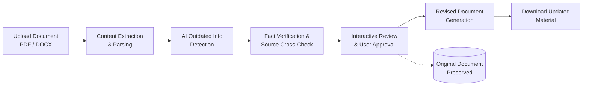

# EduSync: AI-Powered Study Material Updater

An intelligent document revision system designed to identify outdated factual information in educational materials, verify updates against authoritative sources, and produce updated study documents with human-in-the-loop review.

---

## 1. Project Overview

Academic study materials, lecture notes, and textbook excerpts often contain factual information that becomes outdated over time—such as statistical data, software versions, historical developments, scientific discoveries, or regulatory guidelines. Manually reviewing and updating these documents is time-consuming and error-prone.

**EduSync** solves this challenge by providing an automated, AI-augmented workflow for updating educational content. Users can upload documents in standard formats (`.pdf`, `.docx`), extract and analyze the contents using generative AI, review verifiable proposed updates, and generate revised documents without destroying or altering the original source files.

Developed as an MCA Major Project, EduSync demonstrates modern software engineering principles, modular full-stack architecture, and reliable AI integration.

---

## 2. High-Level Planned Workflow



1. **Document Ingestion**:
   - Secure upload and validation of input study material (`.pdf` or `.docx`).
   - Preservation of original documents in persistent, isolated storage.

2. **Content Extraction & Parsing**:
   - Structural text extraction preserving document sections, headings, paragraphs, and metadata.
   - Text segmentation for targeted factual analysis.

3. **Outdated Information Detection**:
   - AI analysis of extracted text to identify time-sensitive claims, obsolete facts, superseded standards, and deprecated references.

4. **Fact Verification**:
   - Cross-referencing identified facts against trusted, authoritative knowledge sources.
   - Generating evidence-backed correction suggestions with confidence scores and source citations.

5. **Human-in-the-Loop Review & Approval**:
   - Interactive user interface presenting side-by-side comparisons of original text versus proposed updates.
   - User controls to accept, reject, or manually edit proposed revisions.

6. **Revised Document Generation**:
   - Generating an updated document reflecting approved changes.
   - Maintaining stylistic consistency while ensuring the original document remains uncompromised and fully accessible.

---

## 3. Planned Technology Stack

| Layer | Technology | Purpose |
|---|---|---|
| **Frontend** | React, TypeScript, Vite | Interactive single-page application (SPA) with real-time diffing and review interface |
| **Backend** | Java 17+, Spring Boot | Modular RESTful API services, business logic, and orchestration |
| **Document Processing** | Apache PDFBox, Apache POI | Text parsing, extraction, and document reconstruction for PDF and DOCX formats |
| **AI / Fact Engine** | Google Gemini API / LLM Services | Semantic analysis, outdated fact detection, and update synthesis |
| **Database & Storage** | PostgreSQL, Local/Cloud Object Storage | Document metadata, revision tracking, user decisions, and file storage |

---

## 4. Repository Structure

```text
EduSync/
├── backend/        # Spring Boot backend application (REST API & services)
├── frontend/       # React web frontend application
├── docs/           # Architecture designs, project documentation, and specifications
├── .gitignore      # Root Git ignore configuration for Java and React environments
└── README.md       # Project overview and technical specification
```

---

## 5. Development Status

- **Status**: `Initial setup`
- **Current Milestone**: Repository structure initialized, architectural guidelines established, and version control baseline configured.
- **Next Steps**:
  - Backend project scaffolding (Spring Boot skeleton).
  - Frontend client scaffolding (React / Vite).
  - Documentation of API specifications and domain models.
